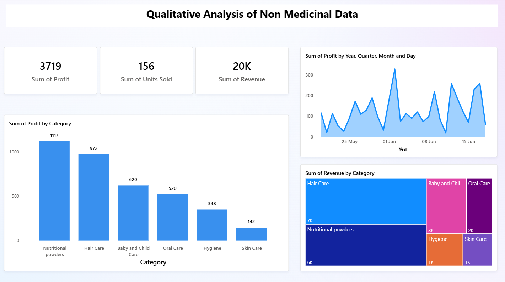
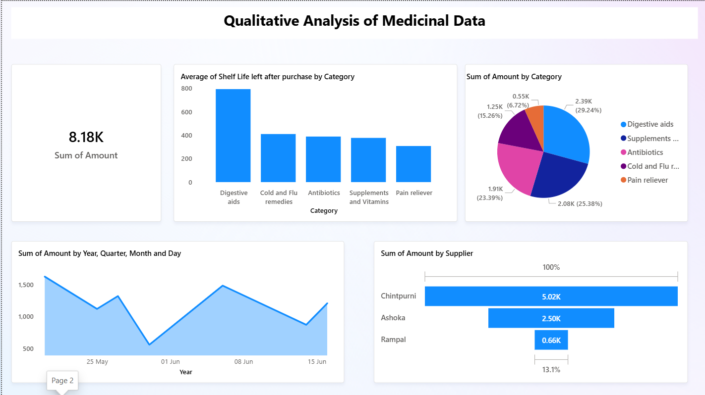

# Optimizing Inventory Efficiency and Category Profitability in a Chemist Store

**End-term Report for the BDM Capstone Project**

**Submitted by:** Harliv Singh (Roll Number: 23f3004092)  
**Program:** IITM Online BS Degree Program, Indian Institute of Technology, Madras  
**Location:** Tamil Nadu, India, 600036

## Overview
This project presents a comprehensive Business Data Management solution for Luthra Medical Store, a rural chemist shop located in Bhagowal, Punjab. The analysis addresses key challenges including ineffective inventory control, stock wastage, and underutilization of non-medicinal products. Through advanced data analysis techniques and Power BI visualization, the project provides actionable strategies to optimize stocking, promote the right SKUs, and increase profitability.

**Data Collection Period:** 30 days (May 20 - June 18)

## Project Contents

### Files Included
- **BDM Project Data.xlsx** - Source data file containing medicinal and non-medicinal product information, sales, costs, and profit metrics
- **BDM-PowerBI-Dashboard.pbix** - Interactive Power BI dashboard featuring medicinal and non-medicinal analysis
- **BDM-project Presentation.pdf** - Comprehensive project report with detailed findings and recommendations

## Dashboard Overview

The Power BI dashboard contains two comprehensive analysis pages:

### Page 1: Non-Medicinal Analysis


This page provides detailed analysis of non-medicinal products including:
- Product performance metrics
- Sales trends and patterns
- Market distribution analysis
- Key performance indicators

### Page 2: Medicinal Analysis


This page focuses on medicinal products with:
- Medicinal product performance
- Clinical and market insights
- Distribution and availability metrics
- Related analytical visualizations

## Getting Started

### Prerequisites
- Power BI Desktop (for viewing and editing the .pbix file)
- Microsoft Excel or compatible spreadsheet software (for viewing the data file)
- Adobe Reader or similar (for the presentation PDF)

### Installation Steps
1. Clone or download the repository
2. Open `BDM-PowerBI-Dashboard.pbix` in Power BI Desktop
3. Review the source data in `BDM Project Data.xlsx`
4. Refer to `BDM-project Presentation.pdf` for context and insights

## Features

- **Interactive Dashboards** - Two comprehensive analysis pages for medicinal and non-medicinal products
- **Inventory Optimization** - ABC classification analysis for inventory control and prioritization
- **Profitability Analysis** - Category-wise profit margins and revenue analysis
- **Sales Performance Metrics** - Sales velocity, daily trends, and customer purchase behavior
- **Supplier Performance Analysis** - Supplier-wise spending and diversification assessment
- **Risk Analysis** - Shelf life monitoring and expiry risk assessment

## Key Analytical Methods

### Medicinal Products Analysis
- Descriptive statistics and distribution analysis
- ABC classification for inventory prioritization
- Supplier performance evaluation
- Daily purchase trends and seasonal patterns
- Category-wise shelf life analysis
- Purchase vs Shelf life risk assessment

### Non-Medicinal Products Analysis
- Category-wise profitability analysis using Pareto principle
- Profit margin analysis by category
- Product sales velocity calculation
- Revenue and profit trend analysis
- Combined product categorization (Priority Products, Hidden Gems, Volume Drivers, Slow & Low items)
- Sales vs profit correlation analysis

## Key Findings

### Medicinal Products
- **Average spending per medicinal product:** ₹1,168.58 over 30 days
- **ABC Classification Results:**
  - **Class A (70% of budget):** Digestive Aids (₹2,392) and Supplements & Vitamins (₹2,076.50) - 54.6% of total spending
  - **Class B (15-20% of budget):** Antibiotics (₹1,913.60) - 23.4% of total spending
  - **Class C (Remaining 10%):** Cold & Flu remedies and Pain relievers - 22% of total spending
- **Shelf Life Risk:** Pain relievers have the shortest average shelf life (377 days), indicating expiry vulnerability
- **Supplier Concentration:** Chintpurni supplier accounts for 61.36% (₹5,020) of medicinal inventory - high reliance risk
- **Spending Distribution:** Left-skewed distribution (-0.603 skewness) indicating most purchases in mid-to-high price range

### Non-Medicinal Products
- **80/20 Pareto Principle:** Top 2 categories (Nutritional Products and Hair Care) generate 70% of profits
- **Priority Products:** Toothpastes, Pampers Diapers, and Dettol Soap show highest sales velocity (>1.3) with strong profit margins (>30%)
- **Hidden Gem:** Indulekha Hair Oil - 45.62% profit margin but slow-moving (1.29 units/day)
- **Best Performers:** 
  - Baby & Child Care: High sales and strong profitability
  - Nutritional Powders (Bournvita, Horlicks): High profit with moderate sales
- **Weak Performers:** Skin Care category shows lowest sales and profitability
- **Seasonal Pattern:** Profit spikes observed on month start (salary season) and Monday (week start)
- **Average Metrics:** Sales Velocity: 1.31 units/day, Profit Margin: 27.46%

## Recommendations

### For Medicinal Products
- Implement expiry tracking and automatic alerts, especially for Class C items with short shelf life
- Focus inventory control on Class A products (Digestive Aids and Supplements)
- Avoid bulk purchases of low-demand, short shelf-life medicines
- Diversify suppliers to reduce reliance on Chintpurni (currently 61% of supply)

### For Non-Medicinal Products
- Prioritize shelf visibility and inventory depth for Nutritional Products, Hair Care, and Baby Products
- Focus on stocking Priority Products: Toothpastes, Pampers, and Dettol Soap
- Consider phasing out consistent underperformers: Boroline, Vaseline
- Evaluate Skin Care and Hygiene categories for replacement with higher-margin products
- Increase marketing efforts for Hidden Gems like Indulekha Hair Oil to boost sales velocity

## Business Context

**Business:** Luthra Medical Store  
**Type:** B2C Rural Chemist Shop  
**Location:** Bhagowal, Punjab  
**Operating Since:** 2004  

**Primary Challenges Addressed:**
- Ineffective inventory control resulting in stock wastage
- Underutilization of non-medicinal products
- Limited profit margins and operational inefficiency

## Tools & Technologies Used
- **Microsoft Excel** - Data collection, cleaning, analysis, pivot tables, and visualizations
- **Power BI** - Interactive dashboard creation and advanced visualizations
- **Analysis Techniques** - Descriptive statistics, ABC classification, Pareto analysis, time series analysis

**Project Status:** Completed  
**Last Updated:** June 2026

## Project Structure
```
Business-Data-Management/
├── BDM Project Data.xlsx
├── BDM-PowerBI-Dashboard.pbix
├── BDM-project Presentation.pdf
├── README.md
└── powerbi-screenshots/
    ├── non_med.png
    └── med.png
```

---
**Last Updated:** June 2026

